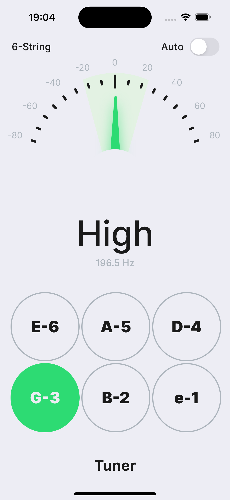
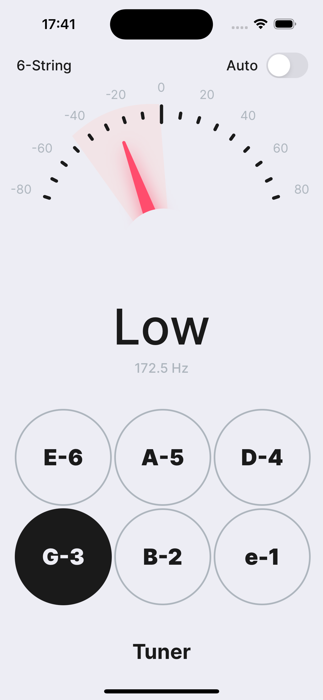

# Guitar Tuner App for IOS

Simple tuner implementation.

  
  

# Features:
- Using [AudioKit](https://github.com/AudioKit/AudioKit) to detect audio input frequency;
- Auto closest note detection mode;
- Custom Fonts;
- MVP.

# Todo:
- Implement choosing any instrument configuration;
- Rewrite frequency detection algoritmth myself.
